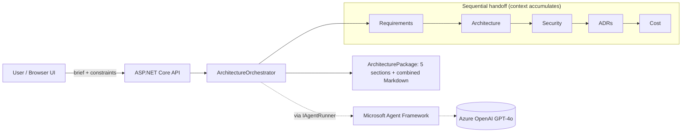

# Enterprise Architecture Agent

> Describe a system in one sentence → **five specialist AI agents** (Requirements · Architecture ·
> Security/GDPR · ADRs · Cost) collaborate to produce a complete, review-ready architecture package.
> Built on the **Microsoft Agent Framework**, **Azure OpenAI (GPT-4o)** and **.NET 10**, using Clean Architecture.

<p align="center">
  
  
  
  
  <a href="https://github.com/JobsDart/enterprise-arch-agent/actions"></a>
</p>

> **▶ Live demo:** https://arch-agent.happywave-99507ff3.swedencentral.azurecontainerapps.io — type a one-line system brief and watch the five agents produce an architecture package. First load may take ~20s while it scales from zero.

---

## What problem does it solve?

Producing the first-cut architecture for a new system — requirements, a C4 diagram, ADRs, a security
& GDPR assessment, and a cost estimate — normally takes a senior architect days of workshops. This
tool generates a credible **starting point in under a minute**, so teams begin design reviews from a
structured draft instead of a blank page. It encodes real practice: DDD bounded contexts, C4
diagrams, the ADR format, OWASP/GDPR checklists, and Azure cost modelling.

## The five agents

| # | Agent | Produces |
|---|-------|----------|
| 1 | **Requirements Analyst** | Functional + non-functional requirements, assumptions |
| 2 | **Solution Architect** | Bounded contexts, architecture style, **Mermaid C4 diagram** |
| 3 | **Security Architect** | Threat overview, OWASP Top 10 table, GDPR checklist, Azure controls |
| 4 | **ADR Author** | 2–3 Architecture Decision Records in standard format |
| 5 | **Cloud Cost Estimator** | Azure monthly cost table + total |

They run as a **sequential handoff pipeline**: each agent receives the brief *plus everything the
previous agents produced*, so the Security, ADR and Cost agents reason about the actual proposed
architecture — not the bare brief.

---

## Architecture



The agent **definitions and orchestration live in Core** (no dependencies); the **Microsoft Agent
Framework runtime lives in Infrastructure** behind `IAgentRunner`. Swapping to Semantic Kernel agents
or a raw model call is a one-class change. Full detail: [docs/ARCHITECTURE.md](docs/ARCHITECTURE.md).

---

## Technology used

| Concern | Technology |
|---------|-----------|
| Language / runtime | C# / **.NET 10** |
| Agent runtime | **Microsoft Agent Framework** (`Microsoft.Agents.AI` 1.10) |
| LLM | **Azure OpenAI — GPT-4o** |
| API | ASP.NET Core Minimal APIs + OpenAPI |
| UI | Vanilla HTML/JS (`wwwroot`) — no build step |
| Architecture | Clean Architecture + DDD |
| Container | Docker (AKS-ready) |

---

## Repository structure

```
enterprise-arch-agent/
├── src/
│   ├── EnterpriseArchAgent.Core/            # Domain, agent catalogue, orchestrator, abstractions
│   │   ├── Domain/                          # AgentRole, AgentSpec, ArchitectureRequest, ArchitecturePackage
│   │   ├── Agents/ArchitectureAgentCatalog  # The 5 agents + their instructions
│   │   ├── Application/ArchitectureOrchestrator
│   │   └── Abstractions/IAgentRunner
│   ├── EnterpriseArchAgent.Infrastructure/  # Microsoft Agent Framework runner + DI
│   │   └── Agents/MafAgentRunner.cs
│   └── EnterpriseArchAgent.Api/             # ASP.NET Core host + browser UI
├── docs/                                    # Architecture, deployment, debugging, ADRs
├── scripts/provision-azure.ps1              # Provision Azure OpenAI
├── Dockerfile
└── EnterpriseArchAgent.sln
```

---

## Quick start

### Prerequisites
- [.NET 10 SDK](https://dotnet.microsoft.com/download)
- An Azure OpenAI resource with a **`gpt-4o`** deployment
  (see [docs/DEPLOYMENT.md](docs/DEPLOYMENT.md) / `scripts/provision-azure.ps1`).

### Configure + run
```powershell
cd src/EnterpriseArchAgent.Api
dotnet user-secrets set "Ai:AzureOpenAI:Endpoint" "https://<your-resource>.openai.azure.com/"
dotnet user-secrets set "Ai:AzureOpenAI:ApiKey"   "<your-key>"
dotnet run
```
Open **http://localhost:5090**, enter a brief such as:

> *"Design a real-time order management system for a B2B retailer with 500 concurrent users."*
> Constraints: *"Must run on Azure, GDPR-compliant, team of 6."*

…and watch the five agents produce a full package you can copy or download as Markdown.

---

## API reference

| Method | Route | Purpose |
|--------|-------|---------|
| `POST` | `/api/architectures` | Run the pipeline → returns the architecture package |
| `GET` | `/openapi/v1.json` | OpenAPI document |

```bash
curl -X POST http://localhost:5090/api/architectures \
  -H "Content-Type: application/json" \
  -d '{ "brief": "Design a patient appointment booking system for a hospital.", "constraints": "Azure, GDPR, HL7 integration" }'
```

Response: `{ brief, sections: [{ role, title, content }], combinedMarkdown, generatedAtUtc }`.

---

## Documentation

- [Architecture](docs/ARCHITECTURE.md) · [Deployment](docs/DEPLOYMENT.md) · [Debugging](docs/DEBUGGING.md) · [ADRs](docs/adr/)

## License & attribution

[MIT](LICENSE) © JobsDart. Built with Microsoft's MIT-licensed
[Agent Framework](https://github.com/microsoft/agent-framework); all code here is original.
