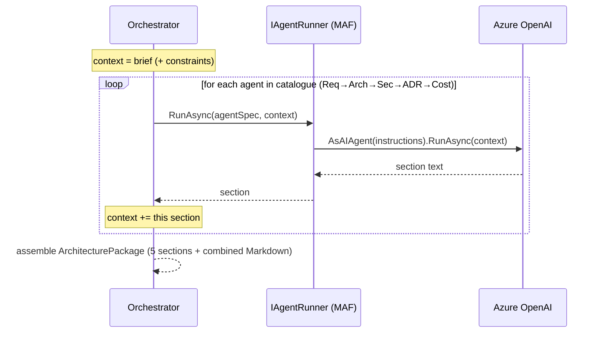

# Architecture

How the Enterprise Architecture Agent is built and why.

## 1. Clean Architecture

Three projects, dependencies pointing inward only:

| Project | Responsibility | Depends on |
|---------|----------------|-----------|
| **Core** | Domain model, the **agent catalogue** (each agent's role + instructions), the **orchestrator**, and the `IAgentRunner` abstraction. No external packages. | nothing |
| **Infrastructure** | `MafAgentRunner` — runs agents with the **Microsoft Agent Framework** against Azure OpenAI. | Core |
| **Api** | ASP.NET Core host, endpoints, browser UI. | Infrastructure, Core |

The crucial point: the **multi-agent design is domain logic, not infrastructure**. *What* the five
agents are, *what* they produce, and *how* context flows between them all live in Core. Infrastructure
only knows *how to execute one agent*. That keeps the system explainable and the runtime swappable.

## 2. The pipeline (sequential handoff)

Because the context accumulates, the **Security agent** critiques the *actual* architecture the
**Architect agent** proposed, the **ADR agent** documents *those* decisions, and the **Cost agent**
prices *those* services. This is what makes the output coherent rather than five disconnected essays.

## 3. Why Microsoft Agent Framework

The Microsoft Agent Framework (MAF) is Microsoft's GA agent runtime (the successor that unifies
Semantic Kernel's orchestration with AutoGen's multi-agent patterns). Each agent is created with
`chatClient.AsAIAgent(instructions, name)` and executed with `agent.RunAsync(...)`. We wrap it behind
`IAgentRunner` so the orchestration never depends on MAF types directly.

See [ADR-0001](adr/0001-agent-framework.md) and [ADR-0002](adr/0002-sequential-orchestration.md).

## 4. Extending it

| You want to… | Change |
|--------------|--------|
| Add an agent (e.g. "Test Strategy") | Add one `AgentSpec` to `ArchitectureAgentCatalog` |
| Reorder / remove agents | Edit the catalogue list |
| Swap MAF for Semantic Kernel agents | New `IAgentRunner` implementation |
| Parallelise independent agents | Change the orchestrator loop (e.g. run Security + Cost concurrently) |
| Persist generated packages | Add an `IPackageStore` + implementation |
